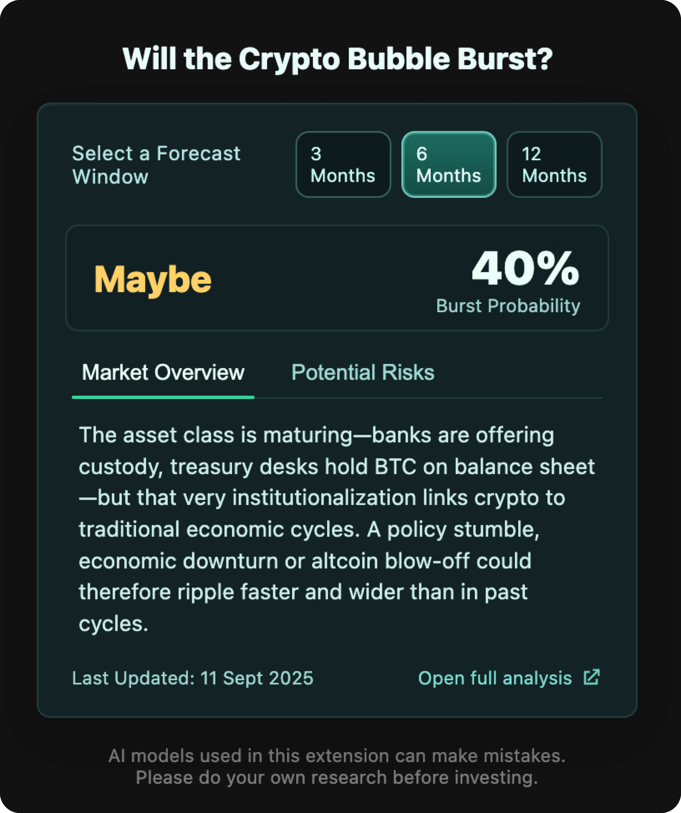

# CryptoBubble Browser Extension
🚀 Multi-browser extension that leverages AI to analyze cryptocurrency market bubble risk.

## Overview

The CryptoBubble Browser Extension provides instant access to cryptocurrency market bubble analysis powered by multiple AI models.
Get real-time insights into whether the crypto market might be heading for a crash, with detailed market overviews and risk catalysts.
Built from a single shared codebase, it supports both Chromium-based browsers and Firefox.

🔗 **Related Project:** This extension complements the full web application at [cryptobubble.ai](https://cryptobubble.ai)

## Screenshot



*The CryptoBubble extension showing a 6-month forecast with 40% bubble burst probability, market overview, and risk analysis.*

## Features

- **🤖 AI-Powered Analysis**: Queries multiple AI models to assess bubble burst probability
- **📊 Real-Time Data**: Fetches the latest market consensus and analysis
- **⏱️ Multiple Timeframes**: View predictions for 3, 6, and 12-month periods
- **💡 Detailed Insights**: Access market overviews and potential risk catalysts
- **🎨 Clean UI**: Modern, responsive interface built with Svelte 5
- **⚡ Lightweight**: Minimal resource usage with fast loading times
- **🌐 Multi-Browser**: Supports Chrome, Edge, Opera, Firefox, and other browsers

## Technology Stack

- **Frontend**: Svelte 5 with modern runes syntax
- **Build System**: Vite + npm with Makefile automation
- **Styling**: Custom CSS with glassmorphism design
- **API**: RESTful integration with CryptoBubble AI backend
- **Icons**: Custom-designed extension icons (16px, 48px, 128px)
- **Architecture**: Single codebase targeting multiple browsers

## Project Structure

```
├── src/                           # Shared Svelte source code
│   ├── App.svelte
│   ├── lib/components/
│   ├── popup.html
│   └── icons/
├── deploy/                        # Browser-specific deployment configs
│   ├── chrome-extension/          # Chrome & Chromium-based browsers
│   │   ├── dev/
│   │   │   ├── manifest.json
│   │   │   └── config.js
│   │   └── prod/
│   │       ├── manifest.json
│   │       └── config.js
│   └── firefox-extension/         # Firefox-specific
│       ├── dev/
│       │   ├── manifest.json
│       │   └── config.js
│       └── prod/
│           ├── manifest.json
│           └── config.js
├── build/                         # Generated extension builds (flat structure)
│   ├── chrome-dev/                # Chrome & Chromium browsers dev build
│   ├── chrome-prod/               # Chrome & Chromium browsers prod build
│   ├── firefox-dev/               # Firefox dev build
│   ├── firefox-prod/              # Firefox prod build
│   └── *.zip                      # Distribution packages
├── Makefile                       # Build automation and packaging
├── package.json                   # Build scripts and dependencies
└── vite.config.js                 # Vite configuration
```

## Development Setup

### Prerequisites
- Node.js 18+ and npm
- Chrome/Chromium browser for testing
- Firefox for Firefox extension testing

### Installation
1. **Clone the repository**
   ```bash
   git clone [repository-url]
   cd cryptobubble-browser-extension
   ```

2. **Install dependencies**
   ```bash
   npm install
   ```

3. **Build for development**
   ```bash
   make chrome-dev    # Chrome/Chromium development build
   make firefox-dev   # Firefox development build
   ```

4. **Load in browser**
   
   **Chrome/Chromium:**
   - Open Chrome and navigate to `chrome://extensions/`
   - Enable "Developer mode"
   - Click "Load unpacked"
   - Select the `build/chrome-dev/` directory
   
   **Firefox:**
   - Open Firefox and navigate to `about:debugging`
   - Click "This Firefox"
   - Click "Load Temporary Add-on"
   - Select any file in the `build/firefox-dev/` directory

## Building Extensions

### Using Makefile (Recommended)
```bash
# Build specific extensions
make chrome-dev          # Chrome & Chromium browsers dev
make chrome-prod         # Chrome & Chromium browsers prod
make firefox-dev         # Firefox dev
make firefox-prod        # Firefox prod

# Build multiple extensions
make all-dev             # All dev extensions
make all-prod            # All prod extensions
make all                 # All extensions

# Build and package for distribution
make pack-chrome-dev     # Build and create cryptobubble-chrome-dev.zip
make pack-chrome-prod    # Build and create cryptobubble-chrome-prod.zip
make pack-firefox-dev    # Build and create cryptobubble-firefox-dev.zip
make pack-firefox-prod   # Build and create cryptobubble-firefox-prod.zip
make pack-all            # Build and package all extensions

# Development helpers
make preview-chrome      # Start dev server with Chrome config
make preview-firefox     # Start dev server with Firefox config
make clean              # Remove all build files
make help               # Show all available commands
```

### Using NPM Scripts (Alternative)
```bash
npm run build:all           # Build all extensions
npm run build:chrome:dev    # Chrome & Chromium browsers dev
npm run build:chrome:prod   # Chrome & Chromium browsers prod
npm run build:firefox:dev   # Firefox dev
npm run build:firefox:prod  # Firefox prod
```

## Development Commands

| Command | Description |
|---------|-------------|
| `make preview-chrome` | Preview Chrome extension in browser at localhost:5173 |
| `make preview-firefox` | Preview Firefox extension in browser at localhost:5173 |
| `npm run dev` | Start development server (browser-agnostic) |
| `npm run preview` | Preview production build |
| `make clean` | Remove build directory |
| `make help` | Show all available commands |

## Output Structure

Built extensions are placed in `build/` directory:
- `build/chrome-dev/` - Chrome & Chromium browsers development version
- `build/chrome-prod/` - Chrome & Chromium browsers production version  
- `build/firefox-dev/` - Firefox development version
- `build/firefox-prod/` - Firefox production version
- `build/*.zip` - Distribution packages (when using `make pack-*` commands)

Each build directory contains:
- `manifest.json` - Browser and environment-specific manifest
- `popup.html` - Extension popup page
- `assets/` - Compiled CSS and JavaScript
- `config.js` - Environment-specific configuration
- `icons/` - Extension icons (16px, 48px, 128px)

## Configuration

### Development vs Production

The extension supports separate build configurations:

**Development (`deploy/*/dev/`):**
- API endpoints point to development/localhost servers
- Extended permissions for local development
- Console logging enabled
- Unminified code for debugging

**Production (`deploy/*/prod/`):**
- API endpoints point to production cryptobubble.ai servers
- Minimal permissions for security
- Optimized build with minified code
- Ready for store submission

### Environment Files
- `deploy/chrome-extension/dev/` - Chrome development configuration
- `deploy/chrome-extension/prod/` - Chrome production configuration
- `deploy/firefox-extension/dev/` - Firefox development configuration  
- `deploy/firefox-extension/prod/` - Firefox production configuration

## Browser Differences

### Chromium-based Browsers (Chrome, Edge, Opera)
- Uses Manifest V3
- Supports environment-specific config.js files
- Standard `host_permissions` format
- Works in Chrome, Edge, Opera, and other Chromium-based browsers
- Submitted to Chrome Web Store

### Firefox
- Uses Manifest V3 with Firefox-specific additions
- Includes `browser_specific_settings.gecko` for Firefox Add-ons store
- Compatible with Firefox 109.0+
- Submitted to Firefox Add-ons store

## API Integration

The extension connects to the CryptoBubble AI API:

**Endpoint:** `https://api.cryptobubble.ai/v1/consensus/latest?lang=en`

**Response Structure:**
```json
{
  "three_months": {
    "bubble_burst_probability": 45,
    "market_overview": "Current market analysis...",
    "bubble_burst_catalyst": ["Risk factor 1", "Risk factor 2"]
  },
  "six_months": { "...": "similar structure" },
  "twelve_months": { "...": "similar structure" },
  "last_updated": "2024-01-15T10:30:00Z"
}
```

## Preview Without Browser Installation

For faster development, you can preview the extension UI in a regular browser:

```bash
make preview-chrome    # Preview with Chrome config
make preview-firefox   # Preview with Firefox config
# Then open http://localhost:5173/popup.html
```

## License

This project is licensed under the MIT License - see the LICENSE file for details.

## Related Links

- **Main Application**: [cryptobubble.ai](https://cryptobubble.ai)
- **Chrome Web Store**: [Link when published]
- **Firefox Add-ons**: [Link when published]

---

Built with ❤️ using Svelte 5 and modern web technologies